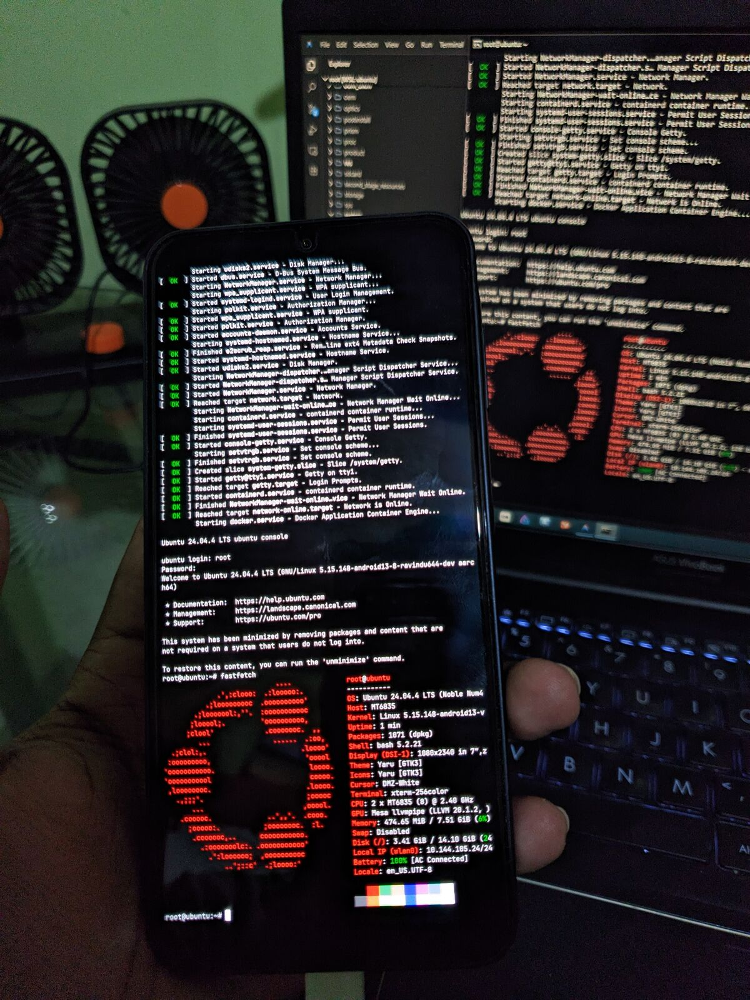
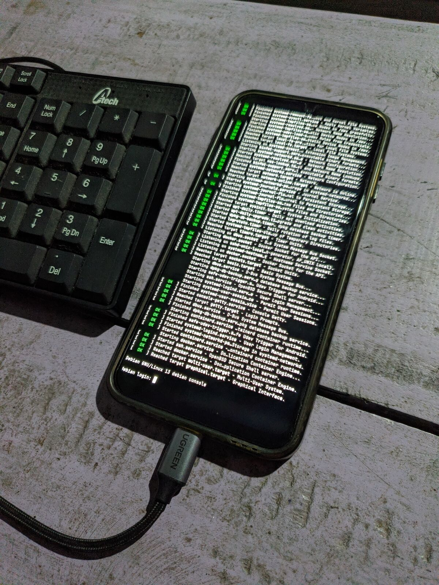
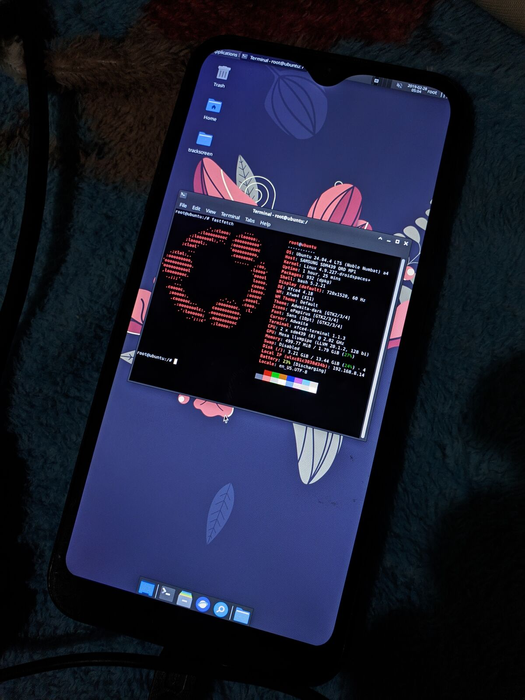
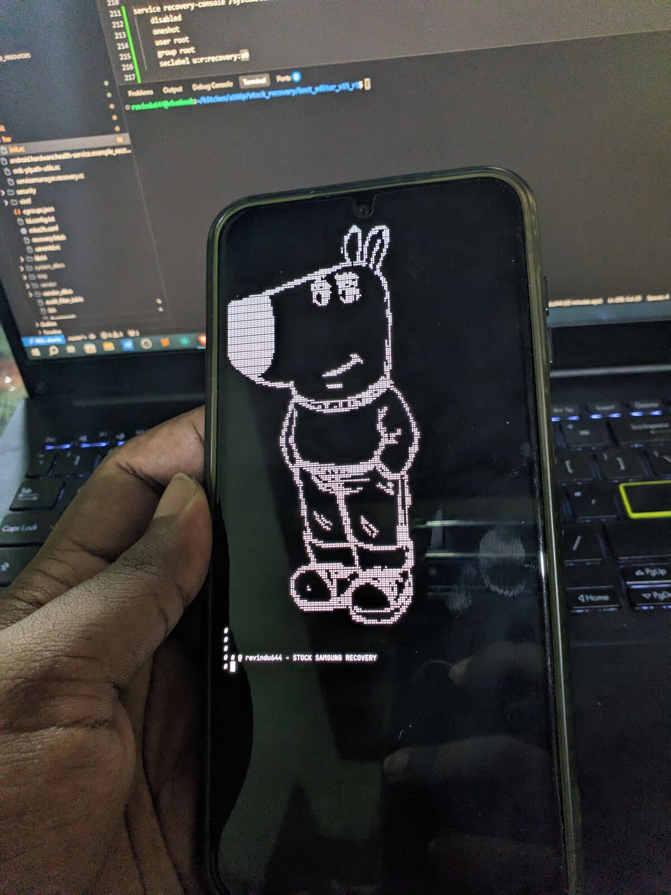
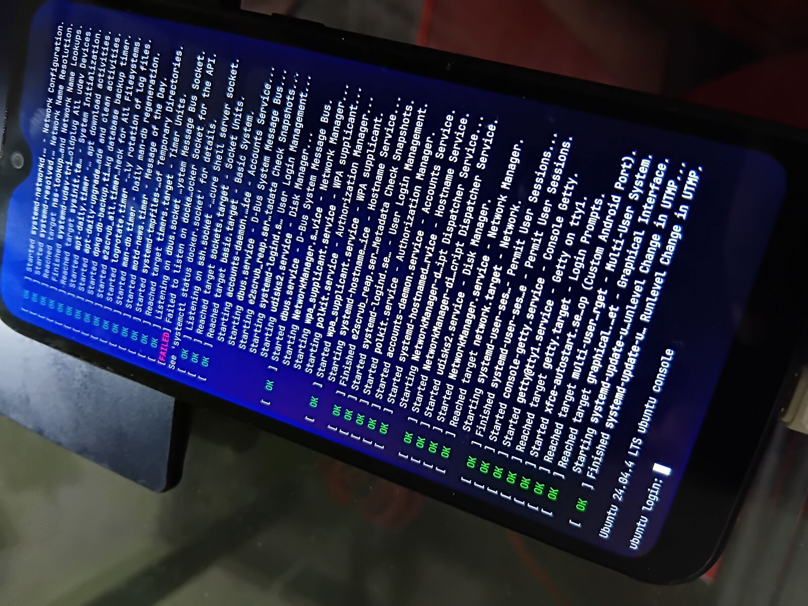

# Recovery Console

### Quick Navigation

- [Features](#features)
- [Gallery](#gallery)
- [Hardware Requirements](#no-universal-build)
- [Customization Guide](#customization-guide)
- [Usage & Integration](#usage-integration)
  - [Safety Warning](#critical-the-suicide-trap)
  - [Recommended Execution](#recommended-execution-methods)
    - [ADB Method](#adb-method)
    - [Init Integration](#init-rc-method)
- [SELinux & Permissions](#selinux-permissions)
- [Droidspaces Integration](#droidspaces-container-booting)
- [Cooking (Installation)](#cooking)
- [Credits](#credits-acknowledgments)
- [Disclaimer](#disclaimer)

A complete replacement for the standard Android Recovery UI. It provides a robust terminal environment allowing users to access an interactive shell or boot full Linux distributions via [Droidspaces](https://github.com/ravindu644/Droidspaces-OSS).

<a id="features"></a>
### Key Features

- **Backends**: Supports both modern Atomic DRM and legacy Framebuffer.
- **VT Aware**: Supports Virtual Terminals (Wayland/X11 co-existence), though stability varies by vendor DRM implementation.
- **Power Management**: Automatic display sleep and manual power-off via Power Key.
- **Intuitive Controls**: Volume buttons for scrolling and full physical keyboard support.
- **Low-Level**: Operates directly on top of the kernel, independent of Android framework services.

<a id="gallery"></a>
## 🖼️ Gallery

<details>
<summary><b>View Project's Screenshots (Linux & Android)</b></summary>

<table align="center">
  <tr valign="top">
    <td colspan="2" align="center">
      <b>Love fastfetch ?</b><br>
      <i>Droidspaces Ubuntu + Recovery Console (DRM)</i><br>
      <br><br>
    </td>
  </tr>
  <tr valign="top">
    <td align="center" width="50%">
      <b>Systemd Boot</b><br>
      <i>External Keyboard + DRM</i><br>
      
    </td>
    <td align="center" width="50%">
      <b>XFCE Desktop</b><br>
      <i>Traditional Framebuffer</i><br>
      
    </td>
  </tr>
  <tr valign="top">
    <td align="center" width="50%">
      <b>Interactive Shell</b><br>
      <i>ASCII Art Demonstration</i><br>
      
    </td>
    <td align="center" width="50%">
      <b>Systemd Logs</b><br>
      <i>Legacy FBdev Rendering</i><br>
      
    </td>
  </tr>
</table>

</details>

<a id="no-universal-build"></a>
## ⚠️ No Universal Build!

This project is **not universal**. Because Android kernels vary wildly in how they handle display hardware (DRM vs FBdev), backlight sysfs paths, screen rotations, and notches, you **must fork this repository** and customize it for your specific device.

<a id="customization-guide"></a>
### Customization Guide

All device-specific logic is centralized in [`include/config.h`](./include/config.h). Before building, you must edit this file to match your hardware:

1.  **Backlight**: Update `BACKLIGHT_PATH` to your kernel's brightness control file.
2.  **Display**: Adjust `ROTATION` (0-3) and `MARGIN_TOP`/`BOTTOM`/`LEFT`/`RIGHT` to handle notches or UI safe areas.
3.  **Color Mode**: Toggle `COLOR_BGR` if your display colors appear swapped.
4.  **Backend**: The console will try [Atomic KMS](https://en.wikipedia.org/wiki/Direct_Rendering_Manager#Atomic_Display_Framework) first and fall back to legacy FrameBuffer (`/dev/fb0`) if needed.

<a id="usage-integration"></a>

## 🚀 Usage & Integration

### Command Line Arguments

- `--background`: Spawns the console as a background daemon.
- `--attach`: Connects to an already running background session (useful for ADB).
- `--exec <cmd>`: Runs a specific command or script instead of the default shell.
- `--help`: Shows basic CLI usage.

<a id="critical-the-suicide-trap"></a>
### ⚠️ Critical: The "Suicide" Trap

**Do not run this binary directly from a terminal emulator inside TWRP/Recovery.**

By design, `recovery-console` stops the standard recovery services (`stop recovery`) to take control of the display. If you run it from a terminal that is itself a child of the recovery process (like TWRP's built-in terminal), you will trigger a "suicide" loop:
1. The console kills the recovery process.
2. The recovery process kills its children (including your terminal).
3. Your terminal kills the console.
4. The display goes completely blank.

<a id="recommended-execution-methods"></a>
### Recommended Execution Methods

<a id="adb-method"></a>
#### 1. The ADB Method (Recommended for Testing)
Always use the `--background` flag when starting from an `adb shell`. This persists the session even if the shell disconnects.
```bash
# Start the daemon
/path/to/recovery-console --background

# Attach to the session
/path/to/recovery-console --attach
```

<a id="init-rc-method"></a>

#### 2. The `init.rc` Method (Permanent Integration)
For a permanent setup, you must disable the stock recovery service and wire the console into your ramdisk's `init.rc`.

**A) Disable Stock Recovery:**
```rc
service recovery /system/bin/recovery
    socket recovery stream 422 system system
    seclabel u:r:recovery:s0
    disabled  # <--- Crucial
```

**B) Define Console Service:**
```rc
service recovery-console /system/bin/recovery-console
    user root
    group root
    oneshot
    disabled
    seclabel u:r:recovery:s0

on boot
    start recovery-console
```

<a id="selinux-permissions"></a>
### 🛡️ SELinux & Permissions

If your kernel is SELinux enforcing, you must patch the recovery policy to be **permissive**. You can use `magiskpolicy` to patch the `sepolicy` file in your ramdisk:

```bash
./magiskpolicy --load sepolicy --save sepolicy.patched '
allow adbd adbd process setcurrent
allow adbd su process dyntransition
permissive { adbd }
permissive { su }
permissive { recovery }
'
```

<a id="droidspaces-container-booting"></a>
### 📦 Droidspaces Container Booting

The console can act as a display server for full Linux containers. The recommended way is to start the `droidspaces` daemon first, then launch the container via a wrapper script passed to `--exec`.

**Wrapper Script (`boot-ubuntu.sh`):**
```shell
#!/system/bin/sh

# Core binary paths
DROIDSPACES_BINARY_PATH=/system/bin/droidspaces
RECOVERY_CONSOLE_PATH=/system/bin/recovery-console

# Container properties
CONTAINER_NAME="Ubuntu 24.04"
CONTAINER_HOSTNAME=ubuntu
DS_FLAGS="--hw-access --privileged=full -B /tmp:/recovery --foreground"

# Rootfs path. Accepts only .img files or raw
# block devices like /dev/block/* (SD cards, partitions).
# If you want to use a directory-based rootfs, simply change
# -i ${ROOTFS_PATH} to -r ${ROOTFS_PATH} in the main command.
ROOTFS_PATH=/dev/block/mmcblk0p1

# Main execution
exec ${RECOVERY_CONSOLE_PATH} \
    --exec "${DROIDSPACES_BINARY_PATH} -i ${ROOTFS_PATH} -n \"${CONTAINER_NAME}\" -h \"${CONTAINER_HOSTNAME}\" ${DS_FLAGS} start"
```

**Integration `init.rc`:**
```rc
service droidspacesd /system/bin/droidspaces daemon --foreground
    user root
    group root
    disabled
    seclabel u:r:recovery:s0

service ubuntu-container /system/bin/sh /system/bin/boot-ubuntu.sh
    user root
    group root
    oneshot
    disabled
    seclabel u:r:recovery:s0

on boot
    start droidspacesd

on property:init.svc.droidspacesd=running
    start ubuntu-container
```

<a id="cooking"></a>
## 🍳 Cooking

Once you have customized `config.h`, you can use the built-in GitHub CI to "cook" your binaries:

1.  **Fork** this repository.
2.  **Commit** your changes to `include/config.h`.
3.  Go to the **Actions** tab in your fork.
4.  Select the **Recovery Console CI** workflow.
5.  Click **Run workflow**, toggle **Create an Official GitHub Release**, and provide a tag name (e.g., `v1.0.0`).
6.  The CI will cross-compile for four architectures (`aarch64`, `armhf`, `x86_64`, `x86`) and upload a versioned tarball to your Releases.

<a id="credits-acknowledgments"></a>
## 💎 Credits & Acknowledgments

This project stands on the shoulders of several incredible open-source projects:

*   **[yaft (yet another framebuffer terminal)](https://github.com/uobikiemukot/yaft)**: The project's core foundation and framebuffer rendering logic.
*   **[st (simple terminal)](https://st.suckless.org/)**: The cursor engine and deferred-wrap logic.
*   **[TWRP (TeamWin Recovery Project)](https://twrp.me/)**: Display power management and DRM kickstart logic.
*   **[JetBrains Mono](https://www.jetbrains.com/lp/mono/)**: The default font, licensed under the [SIL Open Font License 1.1](https://openfontlicense.org).
*   **[FreeType](https://www.freetype.org/)**: Statically-linked font rendering engine.
*   **[Droidspaces](https://github.com/ravindu644/Droidspaces-OSS)**: For the cross-compilation toolchain and CI infrastructure.

---

<a id="disclaimer"></a>
### 🛠️ Disclaimer

This is a **fun project** and not a professional, production-ready tool. It was built with **heavy AI involvement** and may contain bugs, edge cases, or broken implementations on certain hardware. Use it at your own risk!

---
*Created with ❤️ for the Linux on Android Community.*
